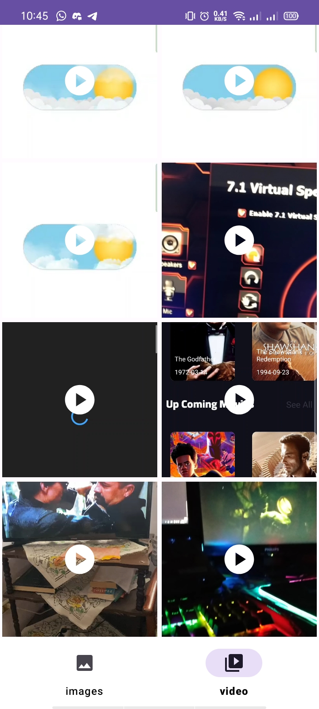
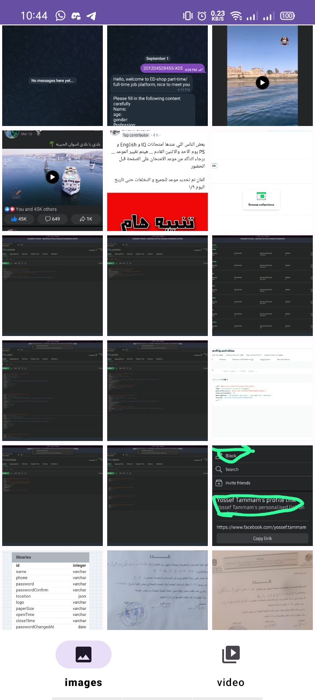

# Android MediaStore Gallery Thumbnails

This Android application demonstrates how to use the Android MediaStore to fetch and display photos and video thumbnails from the device's gallery. With this application, you can easily retrieve and display thumbnails of media files stored in the gallery on your Android device.

## Features

- Display thumbnails of photos and videos from the device's gallery.
- Organize media files by date or other criteria.
- Supported Landscape mode

## Technology Used:
- android
- kotlin
- MVVM
- Media Store
- Flow
- Coroutines
- Glide
- Hilt

|  Video |  Photo |
| --- | --- |
|  |  |
